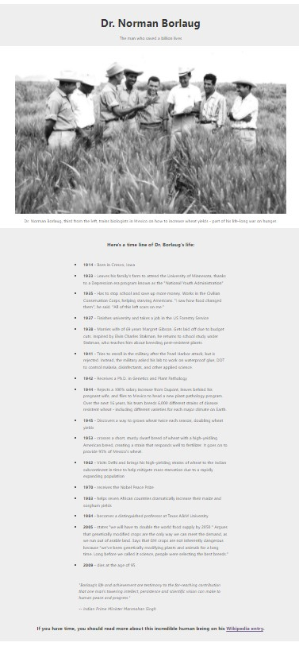

# Symple Tribute Page

In this project, I will implement from scratch, without any library, a very basic tribute page using all HTML/CSS/Accessibility/Responsive design knowledges learned on the FCC course: Responsive Web Design

The objective is simple: Have a fully functional web page that looks like this.

### The following are the UserStories:

### User Story #1: My tribute page should have an element with a corresponding id="main", which contains all other elements.

### User Story #2: I should see an element with a corresponding id="title", which contains a string (i.e. text) that describes the subject of the tribute page (e.g. "Dr. Norman Borlaug").

### User Story #3: I should see either a figure or a div element with a corresponding id="img-div".

### User Story #4: Within the img-div element, I should see an img element with a corresponding id="image".

### User Story #5: Within the img-div element, I should see an element with a corresponding id="img-caption" that contains textual content describing the image shown in img-div.

### User Story #6: I should see an element with a corresponding id="tribute-info", which contains textual content describing the subject of the tribute page.

### User Story #7: I should see an a element with a corresponding id="tribute-link", which links to an outside site that contains additional information about the subject of the tribute page. HINT: You must give your element an attribute of target and set it to _blank in order for your link to open in a new tab (i.e. target="_blank").

### User Story #8: The img element should responsively resize, relative to the width of its parent element, without exceeding its original size.

### User Story #9: The img element should be centered within its parent element.

## Installation

Feel free to download and run the file from this repo:
https://github.com/Julianeme/courses/tree/master/Responsive_Web_Design/Survey_form

## Usage

Just run the index.html file on your own server and modify / remove the files or
lines you wish to have the final result you want

## Contributing
Pull requests are welcome. For major changes, please open an issue first to discuss what you would like to change.

## License
[MIT](https://choosealicense.com/licenses/mit/)